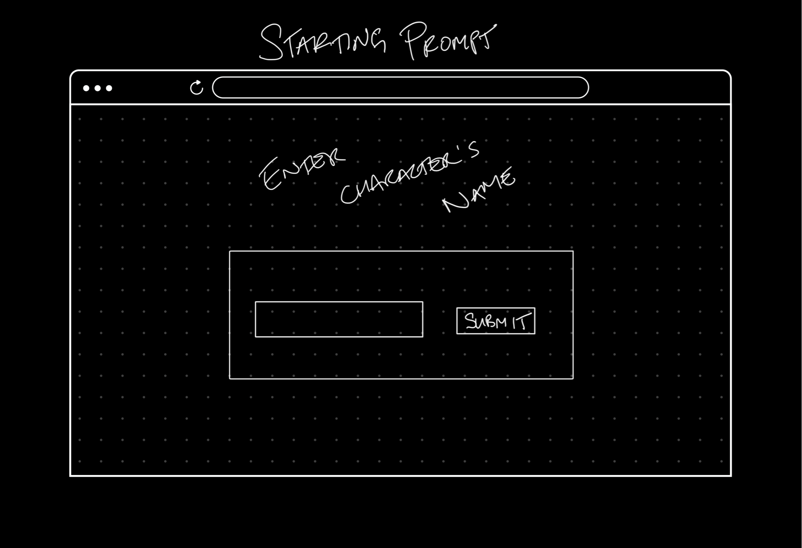
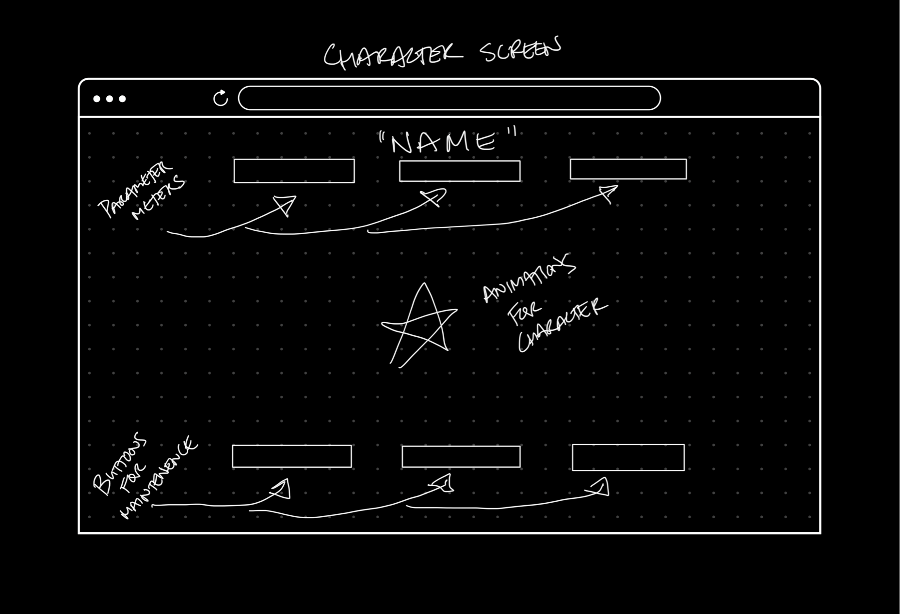
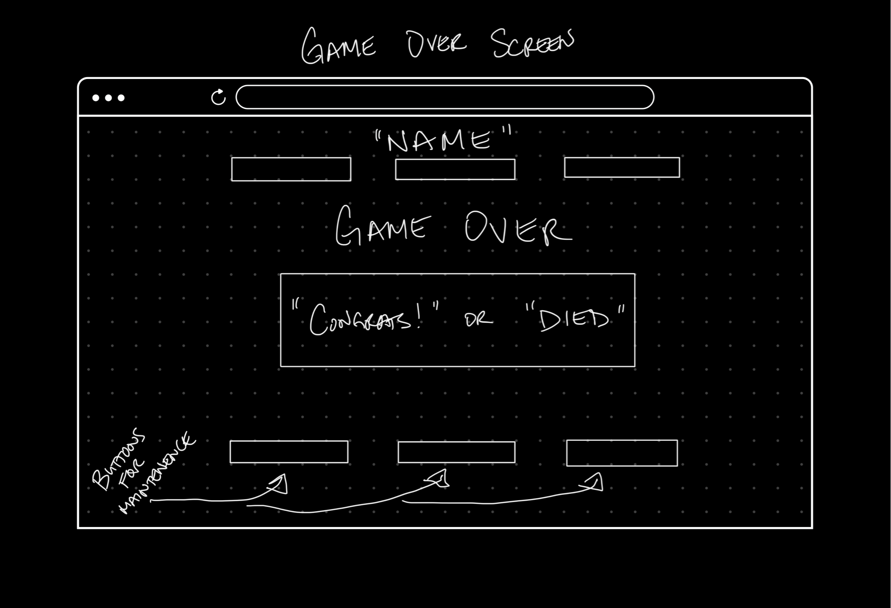

# project-0-game
Unit 1 Project - Making a simple web game

# Scope

Objective is to create a simple web game that will have a character on screen that will evolve into different character levels. Users will be able to press various buttons in order to care for the character. The evolution process will be incremented with time and as long as certain conditions are met, the character will evolve. The game will end either if character dies or the character reaches various parameters over time.

# User Stories

Player will begin with a prompt on the page where they will be asked to enter their name.
    -a container centered on screen will start upon opening the page
    -it should ask what the character name should be to be provided in an input
    -a button should be there to confirm user's choice to then give the value of name of character

Once the name has been entered, that will be the name of the character, who will become a boot camp student learning how to code. As a student, the parameters that the character will need to maintain are, health, sleep, and study (no personal life for a boot camp student).
    -character name should be on top of the screen
    -three status bars on top to show the amount of parameters to full and they should start full
        --status bars will slowly empty via setInterval
        --status descriptions for each status bar
    -character image should be in the middle of the screen
    -three buttons on the bottom to click to fill each corresponding status bar
        --three descriptions above each button
    -game over will happen if one of the status bars become empty

The evolution of a student will be then a developer for a prestigious tech company where the character will need to work hard but also play hard in order to survive. The parameters for this evolution will be work, play, and coffee.
    -three status descriptions should be changed
    -status bars should be refilled
    -setInterval timer should reset
    -image of character should change
    -three button description should change
    -game over will happen if one of the status bars become empty

The final evolution will be an older version of the character which will strive to stay alive to see retirement. The parameters for this evolution will be work, rest, and happiness.
    -three status descriptions should be changed
    -status bars should be refilled
    -setInterval timer should reset
    -image of character should change
    -three button description should change
    -game over will happen if one of the status bars become empty

The game will end if either the character dies or the character maintains happiness until the internal clock reaches a certain point.
    -a game over container will pop up on screen
    -as long as the status bars are not empty, the character will go into retirement
        --container will display "happy retirement"
    -if even one of the status bars become empty
        --container will display "died"
    -buttons should turn off
    -status bars should pause
        --setInterval should be cleared

# Wireframes

# Icebox
1. setup a media query for smaller screens (max-width: 375px)
2. animations for the three characters to provide a little more life ✔️
3. add fontawesome icon animations when buttons are clicked
4. setInterval time to get shorter as each evolution occur to increase difficulty
5. add name, social links, and email ✔️
6. add border around entire page
7. reduce redundant code

# Milestones/Minimal Viable Product
1. Write out HTML for the beginning screen ✔️
    -Container with a header that says "Enter Character's Name" ✔️
    -Dialog box for input ✔️
    -Button to "Submit" input for DOM ✔️

2. Style beginning screen ✔️
    -Use Google Fonts Amatic SC ✔️
    -Center box on the middle of the page ✔️
    -Run through steps to improve UI ✔️

3. Set up event listener for the button ✔️
    -Console log to make sure it works ✔️
    -Create the three character objects ✔️
    -Set button to take the input and make value for the name key for all objects ✔️

4. Write out HTML for the character screen ✔️
    -Set up a header to contain the name of character ✔️
    -Setup progress bars using NES.css ✔️
    -Set image for the character ✔️
    -Setup buttons along the bottom to fill status bars ✔️

5. Style the character screen ✔️

6. Set up event listeners for the status bar buttons ✔️
    -Connect the buttons to correspond to the correct status bar ✔️
    -Set up jQuery to hide the beginning screen content and show character screen content ✔️
    -Set up setInterval timers for each status bar ✔️

7. Write out HTML for game over screen ✔️
    -H1 on the top with "Game Over" ✔️
    -Container with the message "Happy Retirement!!" or "Died" ✔️
    -Button in the container that can start the game over again ✔️

8. Style the game over screen ✔️

9. Set up event listeners for the game over screen ✔️
    -Set the button to reset the game ✔️
    -Set the game over container to stack on top of the character screen ✔️
    -If..else statement for outcome of the game ✔️

# Technologies
Front end - HTML, CSS, JavaScript
jQuery